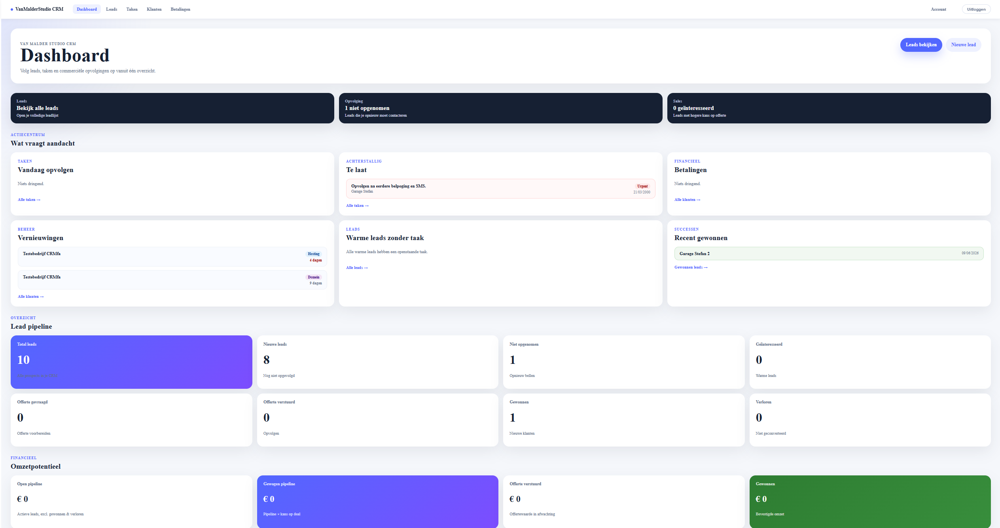
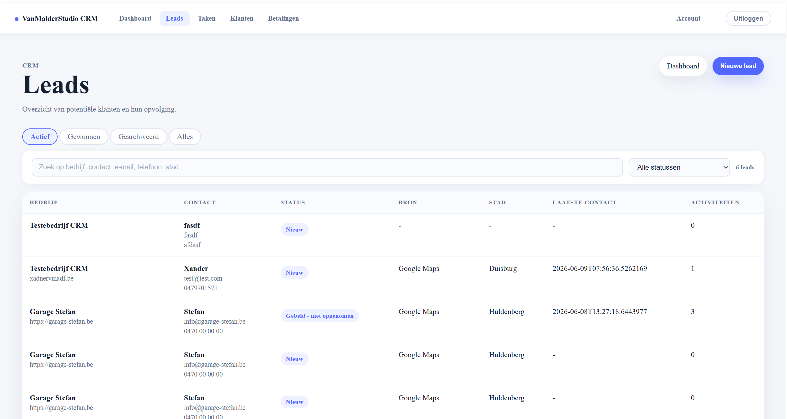
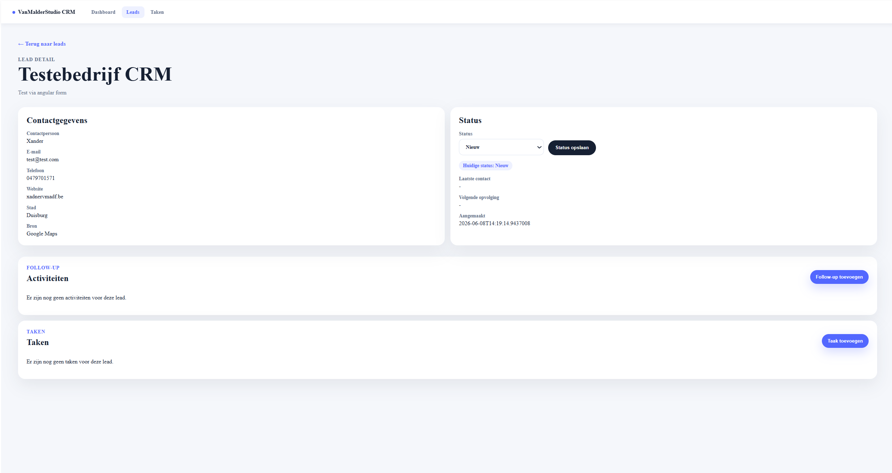

# VanMalderStudio.CRM

VanMalderStudio.CRM is a full-stack CRM and client management platform built for a web studio workflow.

The application supports the complete flow from lead follow-up to won lead, conversion to client, and managing projects, payments, hosting and domain information.

## Tech stack

* ASP.NET Core Web API
* Angular
* Entity Framework Core
* SQL Server
* JWT authentication
* SCSS

## Features

* JWT authentication with protected routes
* Login page and admin account settings
* Dashboard with lead statistics, pipeline value cards and renewal alerts
* Dashboard action center for follow-ups, overdue tasks, overdue payments, upcoming renewals, warm leads without tasks and recently won leads
* Lead management with search, filters and detail edit mode
* Separate lead tabs for Active, Won, Archived and All
* Duplicate prevention for active leads and clients
* Archive/unarchive workflow for leads and clients
* Custom archive modal with optional reason
* Convert Lead to Client workflow
* Follow-up and activity tracking
* Task management
* Client management
* Client detail with business, hosting and domain information
* Monthly payment tracking
* Monthly payment generation
* Manual payment reminder copy action
* Client projects with status, deadline, price and links

## Screenshots

### Login


### Dashboard



### Leads



### Lead detail



### Clients


### Client detail


### Payments


## Getting started

### Backend

```bash
cd VanMalderStudio.CRM.Api
dotnet run --launch-profile https
```

API and Swagger:

```txt
https://localhost:7242/swagger
```

### Frontend

```bash
cd VanMalderStudio.CRM.Web
npm install
ng serve
```

Angular:

```txt
http://localhost:4200
```

## Local development login

For a fresh local development database, the application seeds one development admin user:

```txt
Email: admin@vanmalderstudio.local
Password: Admin123!
```

This account is only intended for local development. After first login, the admin can change the email and password from the Account page.

Personal credentials are stored only in the local database and must never be committed.

## Security notes

* `appsettings.Development.json` should not be committed.
* Production JWT secrets should be configured through environment variables or secure hosting configuration.
* Real SSH passwords, API keys, private keys and server credentials should not be stored in this CRM.

## Project purpose

This project was built as a portfolio application to demonstrate a realistic business workflow using ASP.NET Core, Angular, Entity Framework Core and SQL Server.

It goes beyond basic CRUD by including authentication, lead follow-up, client conversion, archiving, payment tracking, dashboard actions and project management.
