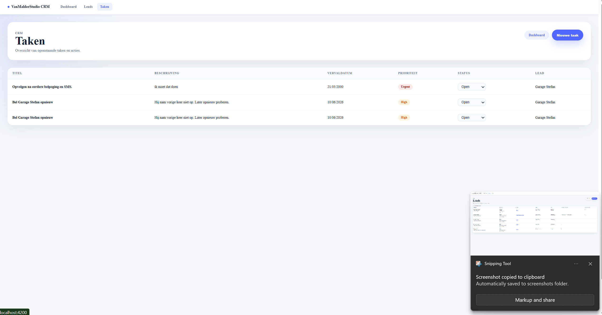

# VanMalderStudio.CRM

A full-stack CRM and lead management application built with **ASP.NET Core Web API**, **Angular**, **Entity Framework Core** and **SQL Server**.

This project was built as a portfolio project to demonstrate practical full-stack development skills with a modern .NET backend and Angular frontend.

## Project Overview

VanMalderStudio.CRM is a lightweight CRM for a small web studio. It helps manage leads, follow-ups, tasks and sales pipeline status.

The application supports:

- Lead management
- Lead status tracking
- Follow-up/activity history
- Task and reminder management
- Dashboard statistics
- Angular frontend connected to an ASP.NET Core API
- SQL Server database using Entity Framework Core migrations

## Tech Stack

### Backend

- ASP.NET Core Web API
- C#
- Entity Framework Core
- SQL Server / SQL Server LocalDB
- Swagger / OpenAPI
- DTO-based API structure

### Frontend

- Angular
- TypeScript
- SCSS
- Standalone Angular components
- Angular routing
- HttpClient services

## Main Features

### Dashboard

The dashboard gives a quick overview of the CRM pipeline:

- Total leads
- New leads
- Leads that did not answer
- Interested leads
- Proposal requested
- Proposal sent
- Won/lost leads
- Open tasks
- Due tasks
- Urgent tasks

Dashboard cards link to filtered lead overviews.

### Leads

The leads module allows users to:

- View all leads
- Create a new lead
- Filter leads by status
- Open a lead detail page
- Update lead status
- View lead contact information
- Track lead source and city

### Lead Detail

Each lead has a dedicated detail page with:

- Contact information
- Current sales status
- Notes
- Follow-up history
- Activity creation
- Task creation linked to the lead

### Follow-ups / Activities

Users can add follow-up activities such as:

- Calls
- SMS messages
- Emails
- Instagram messages
- Meetings
- Proposals
- Notes

These activities are linked to a specific lead and update the lead's follow-up history.

### Tasks

The task module allows users to:

- View all tasks
- Create tasks
- Link tasks to leads
- Set due dates
- Set priority
- Update task status inline
- Track open and completed work

## Architecture

The application is split into two projects:

```txt
VanMalderStudio.CRM
│
├── VanMalderStudio.CRM.Api
│   ├── Controllers
│   ├── Data
│   ├── DTOs
│   ├── Enums
│   ├── Models
│   ├── Migrations
│   └── Program.cs
│
└── VanMalderStudio.CRM.Web
    ├── src/app/pages
    ├── src/app/services
    ├── src/app/app.routes.ts
    └── src/app/app.config.ts

    ## Screenshots

### Dashboard


### Leads


### Lead Detail


### Tasks
